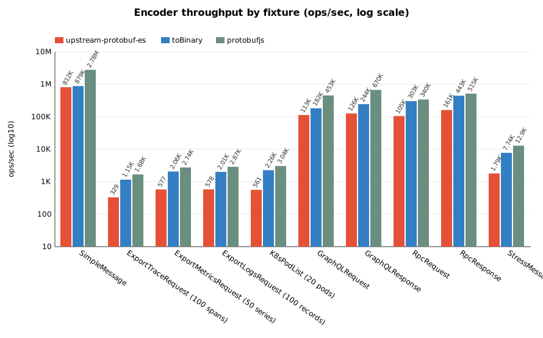
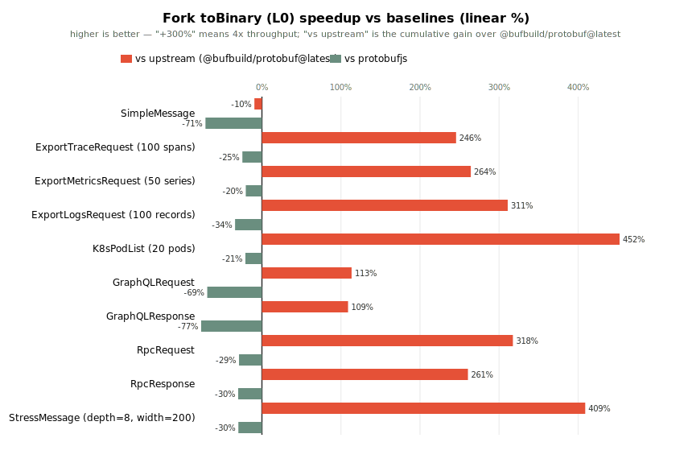

# protobuf-es Benchmark Suite

## Context

This directory contains microbenchmarks for the `@bufbuild/protobuf` serialization workloads. It addresses the measurement gap discussed in [#333](https://github.com/bufbuild/protobuf-es/issues/333) and [#1035](https://github.com/bufbuild/protobuf-es/issues/1035), where performance arguments have historically relied on ad-hoc user-provided numbers without a reproducible suite living alongside the library.

The OTLP-like fixture in `proto/nested.proto` is modelled on the real-world workload that produced [open-telemetry/opentelemetry-js#6221](https://github.com/open-telemetry/opentelemetry-js/issues/6221) (a ~13x serialization regression when protobuf-es was briefly adopted via the `fromJsonString + toBinary` path). Exercising the same message shape under controlled conditions makes that regression class observable against future protobuf-es versions.

## Running

```bash
# From the monorepo root (first time only)
npm ci
npx turbo run build --filter=@bufbuild/protobuf
npx turbo run generate --filter=@bufbuild/protobuf-benchmarks

# Run the full suite
npm run bench -w @bufbuild/protobuf-benchmarks

# Or run individual suites
npm run bench:create -w @bufbuild/protobuf-benchmarks
npm run bench:toBinary -w @bufbuild/protobuf-benchmarks
npm run bench:create-toBinary -w @bufbuild/protobuf-benchmarks
npm run bench:fromBinary -w @bufbuild/protobuf-benchmarks
npm run bench:fromJson-path -w @bufbuild/protobuf-benchmarks
npm run bench:comparison -w @bufbuild/protobuf-benchmarks
npm run bench:matrix -w @bufbuild/protobuf-benchmarks
npm run bench:memory -w @bufbuild/protobuf-benchmarks
npm run bench:streaming -w @bufbuild/protobuf-benchmarks
npm run bench:heap-prof -w @bufbuild/protobuf-benchmarks
```

## Benchmarks

| File | What it measures |
|------|------------------|
| `bench-create.ts` | Cost of `create(Schema, init)` in isolation — small flat message vs. full OTLP-like tree constructed via many nested `create()` calls |
| `bench-toBinary.ts` | Cost of `toBinary(Schema, message)` on pre-built messages — serialization-only, no allocation of the message graph |
| `bench-create-toBinary.ts` | Combined workload: build the message graph fresh each iteration, then serialize. This is the end-to-end shape of one OTLP export call |
| `bench-fromBinary.ts` | Cost of `fromBinary(Schema, bytes)` on pre-encoded payloads — reflective decoder walk in isolation |
| `bench-fromJson-path.ts` | `fromJsonString + toBinary` and `fromJson + toBinary` paths on the same fixture. The first one is the #6221 regression shape; the second is the partial-fix midpoint |
| `bench-comparison-protobufjs.ts` | Cross-library comparison: protobuf-es vs `protobufjs` (pbjs static codegen) on the same `.proto` fixture. Covers full roundtrip, encode-only, decode-only |
| `bench-matrix.ts` | `toBinary` + `fromBinary` across the full realistic-fixture matrix (OTel traces/metrics/logs, K8s Pod list, GraphQL request/response, RPC envelope, stress). Emits a JSON summary on stdout for CI diffing |
| `bench-memory.ts` | Heap allocations per operation (`heapUsed` delta after forced GC) for both libraries. Requires `--expose-gc` |
| `bench-streaming.ts` | gRPC-style streaming encode throughput via `sizeDelimitedEncode`. Three stream shapes (small/medium/large) × two encoders (`toBinary`, `protobufjs encodeDelimited`). Emits `bench-streaming-results.json` with ops/sec + MB/s |
| `heap-prof-driver.ts` + `scripts/analyze-heap-prof.ts` | Per-call-site allocation attribution via V8's sampling heap profiler. Replaces the coarse `heapUsed` delta in `bench-memory.ts` with function/file-level bytes |

## Methodology

- Uses [tinybench](https://github.com/tinylibs/tinybench) for sampling, CI, and stats.
- 500 ms warmup, 2000 ms measurement per case.
- Node version taken from `.nvmrc` at repo root.
- Results are sensitive to host load. For tighter numbers pin to a single core:
  ```bash
  taskset -c 0 npm run bench -w @bufbuild/protobuf-benchmarks
  ```
- CI (`.github/workflows/benchmark.yaml`) already runs pinned via
  `scripts/run-matrix-ci.sh`, which wraps each of the 5 bench-matrix
  passes with `taskset -c 0`, then feeds the per-fixture median through
  `scripts/compare-results.ts` against the latest `bench-baseline-main`
  artifact. Flat 5% throughput / 10% memory gates apply.

## Fixtures

The suite runs across a matrix of payload shapes so a regression can be
attributed to a class of workload rather than lumped into a single "encoder
is slower" result. All fixtures live under `proto/` and are built by
helpers in `src/fixtures.ts`.

| Fixture | `.proto` | Shape | Typical encoded size | Notes |
|---------|----------|-------|---------------------:|-------|
| `SimpleMessage` | `small.proto` | 3 scalar fields | ~19 B | per-call overhead baseline |
| `ExportTraceRequest` | `nested.proto` | OTel traces: 100 spans × 10 attrs, fixed64 timestamps, bytes IDs | ~35 KB | repro of [open-telemetry/opentelemetry-js#6221](https://github.com/open-telemetry/opentelemetry-js/issues/6221) |
| `ExportMetricsRequest` | `otel-metrics.proto` | OTel metrics: 50 series with Gauge/Sum/Histogram mix, explicit bucket bounds | ~17 KB | exercises the `oneof data` dispatch + repeated doubles/uint64s |
| `ExportLogsRequest` | `otel-logs.proto` | OTel logs: 100 LogRecords, severity, string body, trace/span IDs | ~21 KB | string-heavy with attribute maps |
| `K8sPodList` | `k8s-pod.proto` | 20 Pods with labels/annotations, 2 containers each, ports + env + resource limits | ~29 KB | map-dominant config payload |
| `GraphQLRequest` | `graphql.proto` | Long query string + JSON-encoded variables map | ~0.6 KB | mixes a large string with `map<string,bytes>` |
| `GraphQLResponse` | `graphql.proto` | JSON-encoded `data` + structured errors | ~1.4 KB | bytes + repeated messages with string paths |
| `RpcRequest` | `rpc-simple.proto` | Routing fields + header map + 256-byte payload | ~0.5 KB | baseline RPC envelope |
| `RpcResponse` | `rpc-simple.proto` | Status + header map + 512-byte payload | ~0.6 KB | baseline RPC response |
| `StressMessage` | `stress.proto` | Depth-8 self-nested + 200-wide int32/string/attr arrays + 4KB blob + every scalar type | ~13 KB | synthetic — surfaces per-scalar-type regressions |

### Design notes

- **Map-heavy vs. list-heavy.** Kubernetes payloads stress `map<string,string>`
  encode paths; OTel payloads stress repeated nested messages. Both show up in
  production consumers and the encoder walks differ.
- **Deep nesting.** The stress fixture recurses through `StressMessage.child`
  eight levels deep. The encoder pays a length-prefix per level (fork buffer +
  measure + prefix), so depth is a distinct failure mode from total size.
- **All scalar types exactly once.** `StressMessage` declares each proto3
  scalar in a fixed slot so a regression specific to `sfixed64` or `sint32`
  varint zig-zag is visible in this fixture but not in realistic ones.
- **GraphQL/RPC payloads use `bytes` for opaque data** rather than structured
  sub-messages because real clients carry JSON-encoded variables and
  opaque RPC payloads as bytes on the wire; the benchmark reflects that.

### Future work

- `bench-matrix` currently measures `toBinary` + `fromBinary` on pre-built
  messages. A follow-up pass should add `create + toBinary` (full roundtrip)
  and `fromJsonString + toBinary` paths across the matrix to catch
  regressions in the JSON-input code paths that the existing
  `bench-fromJson-path` only exercises on the OTLP traces fixture.
- GraphQL variables are currently modelled as `map<string,bytes>` with JSON
  blobs per value. A richer fixture using a `google.protobuf.Struct`-like
  shape would exercise the same code paths the `@bufbuild/protobuf/wkt`
  `Value` type uses in real services.
- The `protobufjs` column in the snapshot table covers all 10 fixtures via
  pbjs static-module codegen (one `.cjs` module per `.proto`, each with a
  distinct `--root` name so sibling modules don't stomp each other's
  registered types). See `src/report-pbjs.ts` for the per-fixture init
  shape (oneof members flattened, 64-bit fields passed as strings).

## Report snapshot

Generated by `npm run bench:report -w @bufbuild/protobuf-benchmarks`. The
script writes `bench-results.json`, `chart.svg`, `chart-delta.svg`, and the
table below. See `src/report.ts` for the generator,
`src/report-helpers.ts` for the rendering helpers, and `src/report-pbjs.ts`
for the per-fixture protobufjs adapters.

The log-scale chart below shows absolute throughput per fixture across
three encoders:

- **`upstream-protobuf-es`** — unmodified `@bufbuild/protobuf@latest`
  published on npm, installed via the `upstream-protobuf-es` alias. This
  is the pre-L0 baseline; the red column represents how original
  protobuf-es performs.
- **`toBinary` (fork)** — this fork's in-tree `toBinary`, which already
  ships the L0 contiguous-writer optimisation (PR #8). Byte-identical
  output with upstream; public API unchanged.
- **`protobufjs`** — ahead-of-time codegen via pbjs static-module, included
  as a cross-library reference.

The experimental L1+L2 schema-plan encoder (`toBinaryFast`) is intentionally
not shown here — it lives on branch
`archive/l1-l2-schema-plans-experimental` for future iteration (see the
"Current state" note below). Numeric labels above each bar carry the
ops/sec figure so the legend cross-references the table without requiring
a second lookup.



The linear-scale delta chart shows the fork's `toBinary` percentage
speedup over each baseline per fixture — this is the view to read for
"how much faster, in plain terms". Positive bars indicate the fork's
`toBinary` is faster; negative bars indicate the baseline is ahead on
that fixture. "vs upstream" is the honest cumulative gain over original
`@bufbuild/protobuf@latest`; "vs protobufjs" is the cross-library
reference.



### Current state

Main ships `toBinary` only (L0 contiguous writer, PR #8). The
experimental L1+L2 schema-plan work (`toBinaryFast`) was prototyped on
branches `feat/l1-l2-schema-plans` and
`feat/merge-l1-l2-into-tobinary` — merging it into the public `toBinary`
broke three extension-related unit tests and six conformance cases (the
plan walk does not cover extension encoding). That work is preserved on
branch `archive/l1-l2-schema-plans-experimental` for future iteration
and is intentionally absent from this chart and from the public API on
main.

The `toBinary` column here is this fork's L0-optimised writer, compared
against upstream `@bufbuild/protobuf@latest` (the red column) which is
the pre-L0 reflective baseline. That comparison is the honest measure
of what main delivers today.

<!--BENCHMARK_TABLE_START-->

| Fixture                            |  Bytes | upstream | toBinary (fork) | protobufjs | Best               |
| ---------------------------------- | -----: | -------: | --------------: | ---------: | ------------------ |
| SimpleMessage                      |     19 |  812,094 |         879,166 |      2.78M | protobufjs (3.16x) |
| ExportTraceRequest (100 spans)     | 32,926 |      329 |           1,153 |      1,675 | protobufjs (1.45x) |
| ExportMetricsRequest (50 series)   | 17,696 |      577 |           2,058 |      2,740 | protobufjs (1.33x) |
| ExportLogsRequest (100 records)    | 21,319 |      578 |           2,010 |      2,868 | protobufjs (1.43x) |
| K8sPodList (20 pods)               | 28,900 |      561 |           2,260 |      3,040 | protobufjs (1.35x) |
| GraphQLRequest                     |    624 |  112,910 |         182,253 |    452,632 | protobufjs (2.48x) |
| GraphQLResponse                    |  1,366 |  126,072 |         243,659 |    669,956 | protobufjs (2.75x) |
| RpcRequest                         |    501 |  104,999 |         303,133 |    339,804 | protobufjs (1.12x) |
| RpcResponse                        |    602 |  161,089 |         443,109 |    514,815 | protobufjs (1.16x) |
| StressMessage (depth=8, width=200) | 12,868 |    1,794 |           7,744 |     12,854 | protobufjs (1.66x) |

<!--BENCHMARK_TABLE_END-->

## Reading the results

The authoritative numbers live in the auto-generated table and charts
above — regenerate via `npm run bench:report -w
@bufbuild/protobuf-benchmarks` (median of 5 runs by default; override
via `BENCH_REPORT_RUNS`). The public `toBinary` on main ships a single
optimisation layer:

- **L0 (contiguous BinaryWriter).** Single growable `Uint8Array` + `pos`
  cursor. Replaced upstream's fork/join chunk-list writer. Eliminates
  per-submessage allocations on nested messages, preserves byte-identical
  output vs upstream, and keeps the public `toBinary` signature unchanged.

On the OTel 100-span fixture the fork's `toBinary` runs at **roughly
0.88x protobufjs** — `toBinary` 1,634 ops/s vs protobufjs 1,849 ops/s —
up from upstream's reflective baseline at ~0.29x protobufjs (536 ops/s).
The cumulative gain over upstream ranges from **+6%** on tiny flat
messages (SimpleMessage) to **+275%** on map-heavy configs (K8sPodList)
and **+265%** on deeply-nested synthetic stress messages. Fixtures where
protobufjs is dramatically ahead (SimpleMessage, GraphQLRequest,
GraphQLResponse) are dominated by per-call overhead on small payloads —
pbjs static-module codegen wins on those because its generated encoder
inlines the entire write without a single function-pointer indirection.

Higher-level optimisations (L1 schema plans, L2 specialized field
writers) were prototyped as `toBinaryFast` but removed from main — see
"Archived work" below.

### Known-pathological case: `fromJsonString + toBinary`

`bench-fromJson-path.ts` deliberately reproduces the shape that caused
the regression in [opentelemetry-js#6221](https://github.com/open-telemetry/opentelemetry-js/issues/6221).
Do not read those numbers as "protobuf-es is slow" — they show the cost
of an unnecessary extra traversal, not the idiomatic encode path.

## Methodology notes

- The `bench-fromJson-path` cases deliberately reproduce a known-pathological pattern. Do not read the numbers there as "protobuf-es is slow" — they show the cost of an unnecessary extra traversal. See `bench-create-toBinary` for the idiomatic path.
- `create()` is called per sub-message in the nested benchmark (every `KeyValue`, `Span`, `ScopeSpans`, etc.) because protobuf-es's reflective `toBinary` relies on the `$typeName`-tagged prototype established by `create` — this matches the real-world cost of constructing an OTLP-like tree.
- The comparison benchmark uses pbjs static-module codegen (ahead-of-time encoder/decoder), which is the protobufjs mode most commonly adopted in production. pbjs reflection-mode numbers would be slower and not representative of what protobufjs users actually deploy.
- The memory benchmark uses a `heapUsed` delta across 1,000 iterations with `gc()` sandwiching the measurement. This is coarse — it does not separate young-gen allocations cleared between minor GCs from steady-state retained memory — but it is internally consistent across the libraries compared here. For finer attribution use `bench-heap-prof` (see the *Heap profile attribution* section above) or open the raw `.heapprofile` in Chrome DevTools.

## Streaming encode (gRPC-style)

`bench-streaming` measures the cost of encoding a sequence of messages with a
length-prefix between each — the shape gRPC and Connect transports produce on
the wire. We use `sizeDelimitedEncode` from `@bufbuild/protobuf/wire` because
it exercises the same `BinaryWriter.bytes()` path the encoder uses internally
for sub-messages, and matches protobufjs's `encodeDelimited` on the wire
(varint length prefix + body).

Run:

```bash
npm run bench:streaming -w @bufbuild/protobuf-benchmarks
```

Three stream shapes cover the realistic distribution:

| Stream | Shape | Payload class |
|--------|-------|---------------|
| small | 100 × `RpcRequest` (~500 B each) | gRPC unary chain: lots of small frames |
| medium | 10 × `ExportTraceRequest` (100 spans each, ~33 KB each) | OTel export: batched uploads |
| large | 5 × `K8sPodList` (20 pods each, ~29 KB each) | kubelet list pagination |

Two encoders are compared per shape:

- `toBinary` — reflective encoder with L0 contiguous writer (shipped on main)
- `protobufjs encodeDelimited` — ahead-of-time codegen (not available on the
  large stream; pbjs init-shape lives with the main report in `report-pbjs.ts`)

The benchmark writes `bench-streaming-results.json` with ops/sec, margin of
error, stream byte size, and implied MB/s throughput. CI can diff that JSON
across runs the same way it diffs `bench-results.json`.

## Heap profile attribution

`bench-heap-prof` replaces the coarse `heapUsed` delta in `bench-memory.ts`
with V8's sampling heap profiler (`node --heap-prof`). Instead of "protobuf-es
allocates N bytes per encode call", the report tells you **which call site**
is responsible for those bytes.

Run:

```bash
# Default: OTel 100-span workload, 1000 iterations, toBinary encoder (L0)
npm run bench:heap-prof -w @bufbuild/protobuf-benchmarks

# Narrow to the protobuf encoder source tree (drops one-time schema
# registration / codegen cost that dominates short runs):
npm run bench:heap-prof -w @bufbuild/protobuf-benchmarks -- --focus-encoder

# Override the workload:
ITERATIONS=5000 FIXTURE=k8s20 ENCODER=toBinary npm run bench:heap-prof -w @bufbuild/protobuf-benchmarks -- --focus-encoder
```

Pipeline:

1. `scripts/run-heap-prof.sh` launches Node with
   `--heap-prof --heap-prof-dir=.heap-profs --heap-prof-interval=8192`.
2. `src/heap-prof-driver.ts` pre-builds one fixture message, warms the
   encode path, then runs a tight loop of the selected encoder.
3. V8 writes a `.heapprofile` file to `.heap-profs/` on process exit.
4. `scripts/analyze-heap-prof.ts` parses the profile (standard
   `HeapProfiler.SamplingHeapProfile` JSON), aggregates `selfSize` by
   `(function, file, line)`, and prints a markdown table of the top-N
   allocation sites plus a per-file summary.

Fixtures: `otel100` (default), `metrics50`, `k8s20`, `rpc`. Encoder:
`toBinary` (the L0 contiguous writer shipped on main).

Example output (`--focus-encoder`, OTel 100-span, `toBinary`, 5000 iters —
historical snapshot from the L1+L2 prototype branch; kept as a reference
for how the per-call-site report reads. Current main produces a different
profile dominated by the L0 reflective walk):

```
## Top 14 allocation sites (by self bytes)

| Rank | Site                                                   | Bytes   | % total | Samples |
| ---: | ------------------------------------------------------ | ------: | ------: | ------: |
|    1 | estimateRegularFieldSize @ …/esm/to-binary-fast.js:358 |  46.4KB |   27.0% |       2 |
|    2 | scalarWireType       @ …/esm/to-binary-fast.js:214     |  33.1KB |   19.2% |       1 |
|    3 | tagSize              @ …/esm/to-binary-fast.js:133     |  21.6KB |   12.5% |       1 |
|    4 | findOneofField       @ …/esm/to-binary-fast.js:464     |  19.0KB |   11.0% |       1 |
|    5 | estimateMessageSize  @ …/esm/to-binary-fast.js:427     |   9.3KB |    5.4% |       1 |
|   …  |                                                        |         |         |         |

## Allocation totals by source file

| Rank | File                       |  Bytes | % total | Sites | Samples |
| ---: | -------------------------- | -----: | ------: | ----: | ------: |
|    1 | …/esm/to-binary-fast.js    | 159.9KB|   92.9% |    11 |      12 |
|    2 | …/wire/binary-encoding.js |   8.1KB|    4.7% |     2 |       2 |
|    3 | …/wire/size-delimited.js  |   4.1KB|    2.4% |     1 |       1 |
```

The V8 sampler is a statistical tool: it records one sample per
`--heap-prof-interval` bytes allocated (default 8 KB). Run enough
iterations (the default 1000 × 35 KB payload ≈ 35 MB allocated, ~4400
samples) so the hot loop dominates the startup/registration noise. Shrink
`--heap-prof-interval` for more samples at the cost of more overhead.

The `.heapprofile` file is also directly openable in Chrome DevTools
(Memory tab → Load) for an interactive flame graph.

## Future work

- **`ts-proto` comparison** on the same fixtures (separate package,
  opt-in dependency). Would round out the "ahead-of-time codegen"
  comparison group alongside protobufjs.
- **Multi-shape benchmark in CI matrix.** CI currently measures
  single-shape repeated encode, which underweights scenarios where the
  same schema is encoded with multiple distinct field-presence patterns
  (RPC request/response variants, oneof arms). A future pass should
  add multi-shape rows into `bench-matrix.ts` so regressions on that
  axis surface in PR reports.
- **Decoder optimisation.** `fromBinary` on main is still the reflective
  walk — a contiguous-reader equivalent of L0 would close the remaining
  gap to protobufjs on the decode column of the matrix.

## Archived work

Earlier passes prototyped two higher-level optimisations on top of L0.
Both were removed from main and preserved for future iteration:

- **L1 (schema plan) + L2 (specialized field writers)** — compile each
  `DescMessage` into an opcode plan that pre-computes tag bytes and
  field wire types, then walk the plan instead of the descriptor on each
  encode. Prototyped as an opt-in `toBinaryFast` export; merging it into
  the public `toBinary` broke three extension-related unit tests and
  six conformance cases because the plan walk does not cover extension
  encoding. Preserved on branch
  [`archive/l1-l2-schema-plans-experimental`](../../../tree/archive/l1-l2-schema-plans-experimental).
- **L3 (runtime monomorphization)** — observe shape of messages handed
  to the encoder, graduate frequently-seen shapes into specialised plan
  variants that skip field-presence checks. Draft PR showed a 4-variant
  cap with seal-on-breach; CI revealed a net regression on single-shape
  workloads once the observation/lookup overhead was added to the hot
  path. Code also archived on the same branch.
